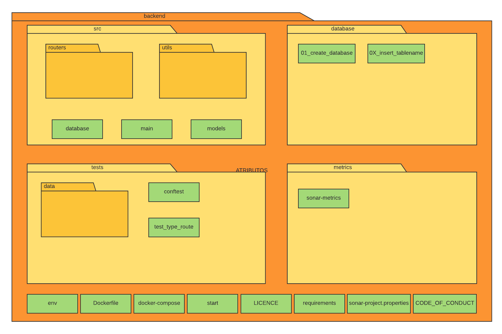
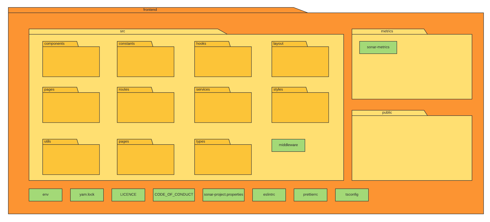
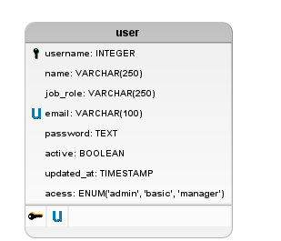
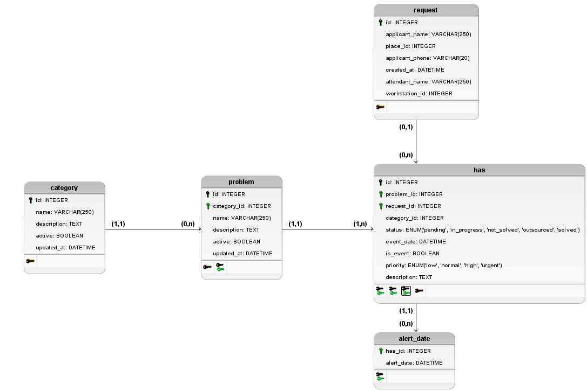

# Documento de Arquitetura

### Histórico da Revisão
| Data       | Versão | Descrição                    | Autor                   |
| ---------- | ------ | ---------------------------- | ----------------------- |
| 18/09/2022 | 1.0    | Criação do documento         | Roberto Martins da Nóbrega      |

## Introdução

### Finalidade

Este documento de arquitetura de software fornece uma visão geral de arquitetura abrangente do sistema de software. Ele pretende capturar e transmitir as decisões arquiteturas significativas que foram tomadas em relação ao sistema. 

### Escopo

Este documento tem como finalidade apresentar a arquitetura do projeto Schedula, que consiste em um sistema de gerenciamento de chamados para a polícia civil do estado do Goiás. O sistema é composto por 3 microserviços de backend e 1 frontend que os utiliza.

## Representação da Arquitetura

### Tecnologias

O projeto utiliza as seguintes tecnologias:

#### Frontend:

- [Nextjs](https://nextjs.org/): Framework para desenvolvimento de aplicações web com React.

A escolha do Nextjs se deu pela facilidade de desenvolvimento e pelas rotas baseadas em sistemas de arquivos, que facilitam a manutenção do projeto.

#### Backend:

- [Fastapi](https://fastapi.tiangolo.com/): Framework para desenvolvimento de aplicações web com Python.

A escolha do Fastapi se deu devido ao fato dos nossos desenvolvedores terem mais experiência com Python do que com outras linguagens exemplificado pela tabela de conhecimento e por sua excelente documentação e facilidade de aprendizado e desenvolvimento.

#### Banco de Dados:

- [PostgreSQL](https://www.postgresql.org/): Banco de dados relacional.

A escolha do PostgreSQL se deu pela facilidade de desenvolvimento e pela sua alta escalabilidade.

### Requisitos e Restrições Arquiteturais

#### Requisitos

| Escalabilidade | Segurança | Confiabilidade | Desempenho |  Deploy |
| -------------- | --------- | -------------- | ---------- |  ------ |
| A aplicação deve ser escalável | A aplicação deve garantir a segurança dos dados sensíveis do usuário | A aplicação deve garantir a confiabilidade dos dados | A aplicação deve garantir um bom desempenho | A aplicação deve possuir deploy automatizado |

#### Restrições

| Conectividade | Plataforma | Equipe |  Prazo | Tecnologias |
| ------------- | ---------- | ------ |  ----- | ----------- | 
| É necessário conecção com a internet para sua utilização | A aplicação será apenas para a plataforma web | A equipe de desenvolvimento é composta por 12 pessoas | O escopo proposto para o MVP deverá ser concluido até o final da disciplina | A aplicação será desenvolvida utilizando as tecnologias listadas na seção de tecnologias |

### Diagrama de Pacotes

Os diagramas de pacote são projetados para fornecer uma estrutura hierárquica das pastas que compõem um projeto. Eles são úteis para mostrar a estrutura de um projeto e como os pacotes estão relacionados entre si.

Backend:

Frontend:

### Visão de Dados

A visão de dados mostra como a camada de persistência do projeto é construída, mapeando objetos e modelos de dados.

#### Diagrama Entidade-Relacionamento (DE-R) - Gestor de Usuários

#### Diagrama Lógico de Dados (DLD) - Gestor de Usuários

#### Diagrama Entidade-Relacionamento (DE-R) - Gerenciador de Localidades

#### Diagrama Lógico de Dados (DLD) - Gerenciador de Localidades

#### Diagrama Entidade-Relacionamento (DE-R) - Detalhador de Chamados

#### Diagrama Lógico de Dados (DLD) - Detalhador de Chamados

## Referências

- [Documentação do Nextjs](https://nextjs.org/docs/getting-started)
- [Documentação do Fastapi](https://fastapi.tiangolo.com/)
- [Documentação do PostgreSQL](https://www.postgresql.org/docs/)
