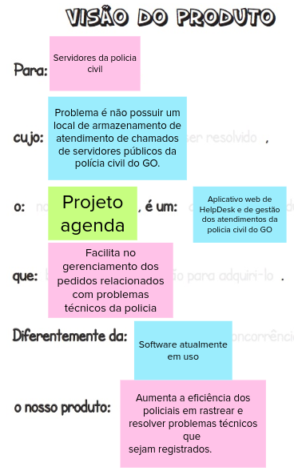

# Visão do produto

A visão do produto ajuda a trilhar o caminho inicial para definir a essência do seu valor de negócio e refletir uma mensagem clara e convincente para o cliente.

**O template é:**

**Para** [Cliente final]

**Cujo** [problema que precisa ser resolvido],

**O** [nome do produto], **É um** [Categoria do produto]

**Que** [benefício chave, razão para adquiri-lo].

**Diferentemente de** [alternativa da concorrência],

**O nosso produto** [diferença chave].

Utilizando o Lean Inception chegamos a seguinte visão de produto:

## Referências

SANTOPIXEL. Visão do Produto – exemplos - Caroli.org. Caroli.org. Disponível em: <https://www.caroli.org/visao-do-produto-exemplos-de-resultados/>. Acesso em: 9 jul. 2022.

‌